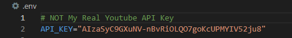

    
[![LinkedIn][linkedin-shield]][linkedin-url]
[![Gmail][gmail-shield]][gmail-url]
[![Twitter][twitter-shield]][twitter-url]
[![Github][github-shield]][github-url]

 

    

<h3 align="center">Python Youtube API Project</h3>

Project covers working with: Tokens, Youtube API, PostgreSQL database...

## Notes To Use Project

You need to put your Youtube developer API key in a `.env` file, within the root directory.

Get Key: [developers.google.com/...](https://developers.google.com/youtube/v3)
Guide: [How To Get Youtube API key](https://www.slickremix.com/docs/get-api-key-for-youtube/)

You will also need to set up a PostgeSQL database using Amazon Web Services (AWS), which you can find more about

## Attribution

<a href="https://www.flaticon.com/free-icon/streaming_5182983" title="api icon on Flaticon.com">Project icon created by shmai - Flaticon</a>

<!-- MARKDOWN LINKS & IMAGES -->
<!-- https://www.markdownguide.org/basic-syntax/#reference-style-links -->

<!-- Badges: https://dev.to/envoy_/150-badges-for-github-pnk -->
[linkedin-shield]: https://img.shields.io/badge/LinkedIn-0077B5?style=for-the-badge&logo=linkedin&logoColor=white
[linkedin-url]: https://linkedin.com/in/sciwilro
[github-shield]: https://img.shields.io/badge/GitHub-100000?style=for-the-badge&logo=github&logoColor=white
[github-url]: https://github.com/SciWilro
[gmail-shield]: https://img.shields.io/badge/Gmail-D14836?style=for-the-badge&logo=gmail&logoColor=white
[gmail-url]: mailto:mr.wilro@gmail.com
[twitter-shield]: https://img.shields.io/badge/Twitter-1DA1F2?style=for-the-badge&logo=twitter&logoColor=white
[twitter-url]: https://twitter.com/The_Wilro