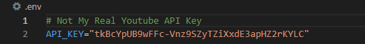

<a name="readme-top"></a>

<div align="center">
    
[![LinkedIn][linkedin-shield]][linkedin-url]
[![Gmail][gmail-shield]][gmail-url]
[![Twitter][twitter-shield]][twitter-url]
[![Github][github-shield]][github-url]
</div>

<br/>

<div align="center">
    <a href="https://github.com/sciwilro/Python_Youtube_API">
        
    </a>

<h3 align="center">Python Youtube API Project</h3>

<p align="center">Working with Youtube's API to collect video statistics from a channel</p>

<p align="center">Project covers working with: Tokens, Youtube API, PostgreSQL database...</p>

</div>

<!-- TABLE OF CONTENTS -->
<details>
    <summary>Table of Contents</summary>
    <ul>
        <li><a href="#notes-to-use-project">Getting Started</a></li>
        <li><a href="#useful-resources">Useful Resources</a></li>
        <li><a href="#attribution">Attribution</a></li>
    </ul>
</details>

<br/>

## Notes To Use Project

You need to put your Youtube developer API key in a `.env` file, within the root directory.



Create Google Developers Account [here](https://developers.google.com/)  
Guide: [How To Get Youtube API key](https://www.slickremix.com/docs/get-api-key-for-youtube/)  

You will also need to set up a PostgeSQL database using Amazon Web Services (AWS)...  
Create AWS Developers Account [here](https://aws.amazon.com/premiumsupport/knowledge-center/create-and-activate-aws-account/)  
Guide: [Guide](https://adamtheautomator.com/rds-postgres/)  

---

## Useful Resources

```html
<div>
    <ul>
        <li><a href="https://developers.google.com/youtube/v3/docs/search">Youtube API Docs - Search</a></li>
        <li><a href="https://jingwen-z.github.io/how-to-get-a-youtube-video-information-with-youtube-data-api-by-python/">Getting Video Information From Youtube API</a></li>
        <li><a href=""></a></li>
    </ul>
    
</div>
```

---

## Attribution

<a href="https://www.flaticon.com/free-icon/streaming_5182983" title="api icon on Flaticon.com">Project icon created by shmai - Flaticon</a>


<!-- MARKDOWN LINKS & IMAGES -->
<!-- https://www.markdownguide.org/basic-syntax/#reference-style-links -->

<!-- Badges: https://dev.to/envoy_/150-badges-for-github-pnk -->
[linkedin-shield]: https://img.shields.io/badge/LinkedIn-0077B5?style=for-the-badge&logo=linkedin&logoColor=white
[linkedin-url]: https://linkedin.com/in/sciwilro
[github-shield]: https://img.shields.io/badge/GitHub-100000?style=for-the-badge&logo=github&logoColor=white
[github-url]: https://github.com/SciWilro
[gmail-shield]: https://img.shields.io/badge/Gmail-D14836?style=for-the-badge&logo=gmail&logoColor=white
[gmail-url]: mailto:mr.wilro@gmail.com
[twitter-shield]: https://img.shields.io/badge/Twitter-1DA1F2?style=for-the-badge&logo=twitter&logoColor=white
[twitter-url]: https://twitter.com/The_Wilro